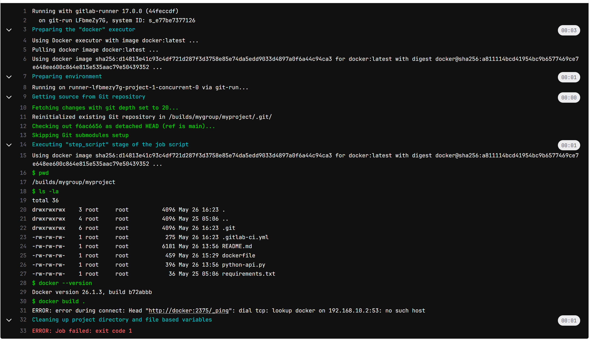
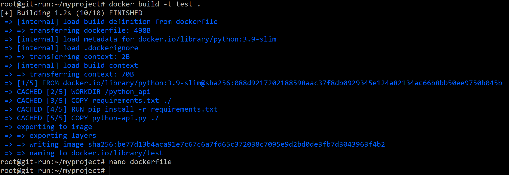
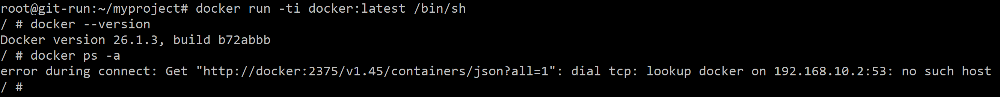

# Домашнее задание к занятию 12 «GitLab»

## Подготовка к выполнению


1. Или подготовьте к работе Managed GitLab от yandex cloud [по инструкции](https://cloud.yandex.ru/docs/managed-gitlab/operations/instance/instance-create) .
Или создайте виртуальную машину из публичного образа [по инструкции](https://cloud.yandex.ru/marketplace/products/yc/gitlab ) .

Создал ВМ.
Вошел с пользователем root и паролем:


2. Создайте виртуальную машину и установите на нее gitlab runner, подключите к вашему серверу gitlab  [по инструкции](https://docs.gitlab.com/runner/install/linux-repository.html) .

создал ВМ и установил:


Но, раннер похоже не установлися, т.к. нужен еще докер (?):


Поставил докер:

```
sudo apt-get update
sudo apt-get install -y ca-certificates curl gnupg

sudo install -m 0755 -d /etc/apt/keyrings
curl -fsSL https://download.docker.com/linux/ubuntu/gpg | sudo gpg --dearmor -o /etc/apt/keyrings/docker.gpg
sudo chmod a+r /etc/apt/keyrings/docker.gpg

echo \
  "deb [arch="$(dpkg --print-architecture)" signed-by=/etc/apt/keyrings/docker.gpg] https://download.docker.com/linux/ubuntu \
  "$(. /etc/os-release && echo "$VERSION_CODENAME")" stable" | \
  sudo tee /etc/apt/sources.list.d/docker.list > /dev/null

sudo apt-get update

sudo apt-get install -y docker-ce docker-ce-cli containerd.io docker-buildx-plugin docker-compose-plugin

```

Опять пробую установить - пишет что уже все установлено:


При попытке создать раннер в gitlab - долго крутится кружочек ждем, потом пишет:


Пока не понял, в чем проблема?


И gtilab уж очень томозной, хотя было 4 ядра и 4 RAM. Попробовал пересобрать ВМ с 8 Гб.

Перезапустил ВМ с 8 Гб.
Опять пробую создать раннер:


Создал раннер:


далее тут смотрю инструкции:


Пробую запустить получаю ошибку:


ошбика - т.к. IP адрес у ВМ уже поменялся.
Попробую все заново, только с доступом через доменное имя и так gitlab инициализировать, чтобы было в конфигах доменное имя.

В итоге настроил gitlab по https:
Подготовил команды в файле mysedcommands для правки конфига гитлаба и запустил:

```
sudo sed -iE -f mysedcommands  /etc/gitlab/gitlab.rb
sudo gitlab-ctl reconfigure
```
После чего gilab заработал по https и в моем домене:


Создал раннер:


Опять поставил докер на гитлаб раннер.
Установил раннер.


проверил:


Привожу конфиг раннера:

```
root@git-run:~# cat /etc/gitlab-runner/config.toml
concurrent = 1
check_interval = 0
connection_max_age = "15m0s"
shutdown_timeout = 0

[session_server]
  session_timeout = 1800

[[runners]]
  name = "git-run"
  url = "https://git.dmil.ru"
  id = 1
  token = "glrt-LFbmeZy7GsVnkPHV4H8u"
  token_obtained_at = 2024-05-24T06:57:34Z
  token_expires_at = 0001-01-01T00:00:00Z
  executor = "docker"
  [runners.custom_build_dir]
  [runners.cache]
    MaxUploadedArchiveSize = 0
    [runners.cache.s3]
    [runners.cache.gcs]
    [runners.cache.azure]
  [runners.docker]
    tls_verify = false
    image = "docker:latest"
    privileged = false
    disable_entrypoint_overwrite = false
    oom_kill_disable = false
    disable_cache = false
    volumes = ["/cache"]
    shm_size = 0
    network_mtu = 0
```


3. (* Необязательное задание повышенной сложности. )  Если вы уже знакомы с k8s попробуйте выполнить задание, запустив gitlab server и gitlab runner в k8s  [по инструкции](https://cloud.yandex.ru/docs/tutorials/infrastructure-management/gitlab-containers). 

4. Создайте свой новый проект.

Создал.

5. Создайте новый репозиторий в GitLab, наполните его [файлами](./repository).

Наполнил:


6. Проект должен быть публичным, остальные настройки по желанию.

Публичный.

## Основная часть

### 2024.05.26

Текущее состояние на 26 мая:

Спасибо за пояснение. Файл .gitlab-ci.yml скорректировал.

Создал свой проект на своем гитлабе и наполнил файлами:

https://git.dmil.ru/mygroup/myproject

Копию репозитория в текущем состоянии положил и сюда (т.к. моя ВМ может быть выключена):
https://github.com/DmitryIll/gilab-hw-myproject/ 

- там подготовил dockerfile, .gitlab-ci.yml и пр. что как думаю нужно для сборки.

Опять требуется помощь, возникли вопросы:

При создании gitlab раннера я указыал использовать docker:latest образ. Т.е. он (как я понял) должен будет стартовать на ВМ раннере при выполнении задач. 

Но, получаю ошибку например такую:



При этом в .gitlab-ci.yaml

```
#  image: docker:20.10.8
#  services:
#    - docker:20.10.8-dind


stages:
 - build

build:
 stage: build
  # image: docker:20.10.8-dind
#  image: centos:latest
#  image: python:3.9-slim
 script:
  - pwd
  - ls -la
  - docker --version
  - docker build .

```

в докерфайле:

```
FROM python:3.9-slim

WORKDIR /python_api
COPY requirements.txt ./
RUN pip install -r requirements.txt
COPY python-api.py ./
CMD ["python", "python-api.py"]
```

В чем причина ошибки? И не понял что именно происходит в докер контейнере docker:latest?
Моя сборка пробует выполняться в контйнере из образа docker:latest?
Т.е. там внутри контейнера есть вложенный докер?

При этом если я выполняю сборку вручную прям на раннере, то, все ок:



Но, сборка внутри докер контейнера - не идет.

При этом пробовал вручную запустить контейнер из этого образа:



- получается докер не работает внутри контейера?
В чем причина?

Еще вопросы:
Если я в .gitlab-ci.yml пропиши образы, например пробовал разные:

```

build:
 stage: build
  # image: docker:20.10.8-dind
#  image: centos:latest
#  image: python:3.9-slim
 script:
  - pwd
  - ls -la
  - docker --version
  - docker build .
```
но, все равно ошибка. 
В чем суть этих образов? Они где будут использоваться?
Я предполагал они должны использоваться вместо образа по умолчанию У раннера - docker:latest?
Пробовал разные образы у всех ошибки.

Прошу помочь разобраться.


### DevOps

В репозитории содержится код проекта на Python. Проект — RESTful API сервис. Ваша задача — автоматизировать сборку образа с выполнением python-скрипта:


1. Образ собирается на основе [centos:7](https://hub.docker.com/_/centos?tab=tags&page=1&ordering=last_updated).
2. Python версии не ниже 3.7.
3. Установлены зависимости: `flask` `flask-jsonpify` `flask-restful`.
4. Создана директория `/python_api`.
5. Скрипт из репозитория размещён в /python_api.
6. Точка вызова: запуск скрипта.
7. При комите в любую ветку должен собираться docker image с форматом имени hello:gitlab-$CI_COMMIT_SHORT_SHA . Образ должен быть выложен в Gitlab registry или yandex registry.   

### Product Owner

Вашему проекту нужна бизнесовая доработка: нужно поменять JSON ответа на вызов метода GET `/rest/api/get_info`, необходимо создать Issue в котором указать:

1. Какой метод необходимо исправить.
2. Текст с `{ "message": "Already started" }` на `{ "message": "Running"}`.
3. Issue поставить label: feature.

### Developer

Пришёл новый Issue на доработку, вам нужно:

1. Создать отдельную ветку, связанную с этим Issue.
2. Внести изменения по тексту из задания.
3. Подготовить Merge Request, влить необходимые изменения в `master`, проверить, что сборка прошла успешно.


### Tester

Разработчики выполнили новый Issue, необходимо проверить валидность изменений:

1. Поднять докер-контейнер с образом `python-api:latest` и проверить возврат метода на корректность.
2. Закрыть Issue с комментарием об успешности прохождения, указав желаемый результат и фактически достигнутый.

## Итог

В качестве ответа пришлите подробные скриншоты по каждому пункту задания:

- файл gitlab-ci.yml;
- Dockerfile; 
- лог успешного выполнения пайплайна;
- решённый Issue.

### Важно 
После выполнения задания выключите и удалите все задействованные ресурсы в Yandex Cloud.

