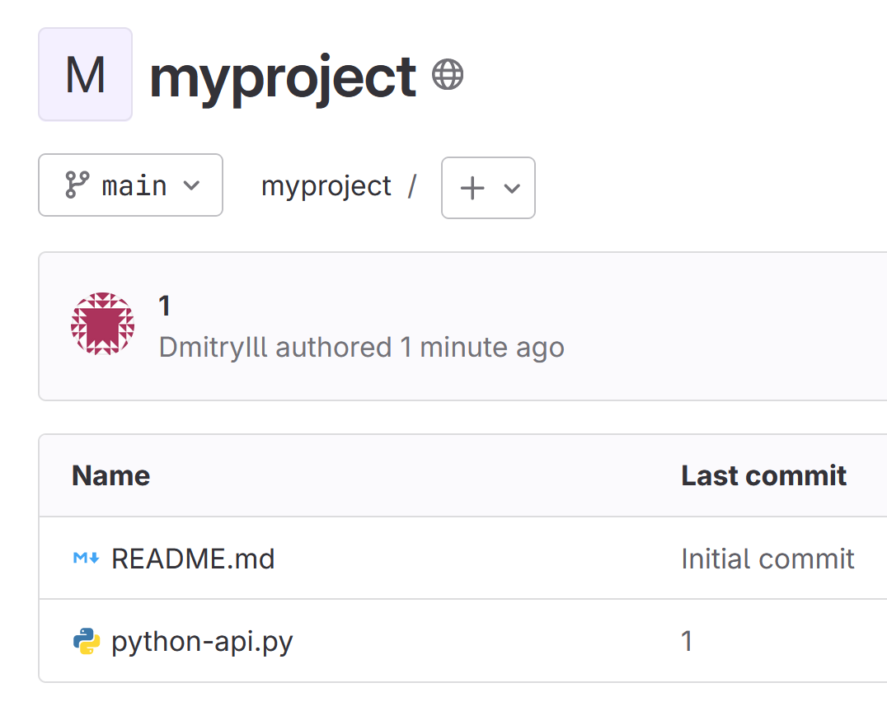

# Домашнее задание к занятию 12 «GitLab»

## Подготовка к выполнению


1. Или подготовьте к работе Managed GitLab от yandex cloud [по инструкции](https://cloud.yandex.ru/docs/managed-gitlab/operations/instance/instance-create) .
Или создайте виртуальную машину из публичного образа [по инструкции](https://cloud.yandex.ru/marketplace/products/yc/gitlab ) .

Создал ВМ.
Вошел с пользователем root и паролем:


2. Создайте виртуальную машину и установите на нее gitlab runner, подключите к вашему серверу gitlab  [по инструкции](https://docs.gitlab.com/runner/install/linux-repository.html) .

создал ВМ и установил:


Но, раннер похоже не установлися, т.к. нужен еще докер (?):


Поставил докер:

```
sudo apt-get update
sudo apt-get install -y ca-certificates curl gnupg

sudo install -m 0755 -d /etc/apt/keyrings
curl -fsSL https://download.docker.com/linux/ubuntu/gpg | sudo gpg --dearmor -o /etc/apt/keyrings/docker.gpg
sudo chmod a+r /etc/apt/keyrings/docker.gpg

echo \
  "deb [arch="$(dpkg --print-architecture)" signed-by=/etc/apt/keyrings/docker.gpg] https://download.docker.com/linux/ubuntu \
  "$(. /etc/os-release && echo "$VERSION_CODENAME")" stable" | \
  sudo tee /etc/apt/sources.list.d/docker.list > /dev/null

sudo apt-get update

sudo apt-get install -y docker-ce docker-ce-cli containerd.io docker-buildx-plugin docker-compose-plugin

```

Опять пробую установить - пишет что уже все установлено:


При попытке создать раннер в gitlab - долго крутится кружочек ждем, потом пишет:


Пока не понял, в чем проблема?


И gtilab уж очень томозной, хотя было 4 ядра и 4 RAM. Попробовал пересобрать ВМ с 8 Гб.

Перезапустил ВМ с 8 Гб.
Опять пробую создать раннер:


Создал раннер:


далее тут смотрю инструкции:


Пробую запустить получаю ошибку:


ошбика - т.к. IP адрес у ВМ уже поменялся.
Попробую все заново, только с доступом через доменное имя и так gitlab инициализировать, чтобы было в конфигах доменное имя.

В итоге настроил gitlab по https:
Подготовил команды в файле mysedcommands для правки конфига гитлаба и запустил:

```
sudo sed -iE -f mysedcommands  /etc/gitlab/gitlab.rb
sudo gitlab-ctl reconfigure
```
После чего gilab заработал по https и в моем домене:


Создал раннер:


Опять поставил докер на гитлаб раннер.
Установил раннер.


проверил:


Привожу конфиг раннера:

```
root@git-run:~# cat /etc/gitlab-runner/config.toml
concurrent = 1
check_interval = 0
connection_max_age = "15m0s"
shutdown_timeout = 0

[session_server]
  session_timeout = 1800

[[runners]]
  name = "git-run"
  url = "https://git.dmil.ru"
  id = 1
  token = "glrt-LFbmeZy7GsVnkPHV4H8u"
  token_obtained_at = 2024-05-24T06:57:34Z
  token_expires_at = 0001-01-01T00:00:00Z
  executor = "docker"
  [runners.custom_build_dir]
  [runners.cache]
    MaxUploadedArchiveSize = 0
    [runners.cache.s3]
    [runners.cache.gcs]
    [runners.cache.azure]
  [runners.docker]
    tls_verify = false
    image = "docker:latest"
    privileged = false
    disable_entrypoint_overwrite = false
    oom_kill_disable = false
    disable_cache = false
    volumes = ["/cache"]
    shm_size = 0
    network_mtu = 0
```


3. (* Необязательное задание повышенной сложности. )  Если вы уже знакомы с k8s попробуйте выполнить задание, запустив gitlab server и gitlab runner в k8s  [по инструкции](https://cloud.yandex.ru/docs/tutorials/infrastructure-management/gitlab-containers). 

4. Создайте свой новый проект.

Создал.

5. Создайте новый репозиторий в GitLab, наполните его [файлами](./repository).

Наполнил:



6. Проект должен быть публичным, остальные настройки по желанию.

Публичный.

## Основная часть

### 2024.05.27

Текущее состояние на 27 мая:

Спасибо за подсказки, но, пока не заработало.
Указал везде уж где только можно docker:dind
Пробовал уже много вариантмо по-разному, всегда ошибки.
Что же не так, в чем причина?


Код:

```
image: docker:dind
services:
  - docker:dind

stages:
  - build

build:
  stage: build
  image: docker:dind
  script:
    - docker --version
    - docker build .
```

Опять ошибки:

```
Running with gitlab-runner 17.0.0 (44feccdf)
  on git-run LFbmeZy7G, system ID: s_e77be7377126
Preparing the "docker" executor 00:35
Using Docker executor with image docker:dind ...
Starting service docker:dind ...
Pulling docker image docker:dind ...
Using docker image sha256:d14813e41c93c4df721d287f3d3758e85e74da5edd9033d4897a0f6a44c94ca3 for docker:dind with digest docker@sha256:a811114bcd41954bc9b6577469ce7e648ee600c864e815e535aac79e50439352 ...
Waiting for services to be up and running (timeout 30 seconds)...
*** WARNING: Service runner-lfbmezy7g-project-1-concurrent-0-3b87b538ae2e9649-docker-0 probably didn't start properly.
Health check error:
service "runner-lfbmezy7g-project-1-concurrent-0-3b87b538ae2e9649-docker-0-wait-for-service" timeout
Health check container logs:
2024-05-27T05:34:10.812019564Z waiting for TCP connection to 172.17.0.2 on [2375 2376]...
2024-05-27T05:34:10.812432382Z dialing 172.17.0.2:2376...
2024-05-27T05:34:10.812720357Z dialing 172.17.0.2:2375...
2024-05-27T05:34:11.814611160Z dialing 172.17.0.2:2376...
2024-05-27T05:34:11.814876174Z dialing 172.17.0.2:2375...
2024-05-27T05:34:12.816345444Z dialing 172.17.0.2:2375...
2024-05-27T05:34:12.816406776Z dialing 172.17.0.2:2376...
2024-05-27T05:34:13.816514583Z dialing 172.17.0.2:2376...
2024-05-27T05:34:13.816563570Z dialing 172.17.0.2:2375...
Service container logs:
2024-05-27T05:34:12.771850235Z Certificate request self-signature ok
2024-05-27T05:34:12.771978858Z subject=CN=docker:dind server
2024-05-27T05:34:12.794387858Z /certs/server/cert.pem: OK
2024-05-27T05:34:13.488436959Z Certificate request self-signature ok
2024-05-27T05:34:13.488486589Z subject=CN=docker:dind client
2024-05-27T05:34:13.511872680Z /certs/client/cert.pem: OK
2024-05-27T05:34:13.515039643Z cat: can't open '/proc/net/ip6_tables_names': No such file or directory
2024-05-27T05:34:13.515810406Z cat: can't open '/proc/net/arp_tables_names': No such file or directory
2024-05-27T05:34:13.518428767Z ip: can't find device 'nf_tables'
2024-05-27T05:34:13.519610187Z nf_tables             266240 43 nft_chain_nat,nft_counter,nft_compat
2024-05-27T05:34:13.520104351Z nfnetlink              20480  4 nf_conntrack_netlink,nft_compat,nf_tables
2024-05-27T05:34:13.520121011Z libcrc32c              16384  5 nf_nat,nf_conntrack,nf_tables,btrfs,raid456
2024-05-27T05:34:13.520712327Z modprobe: can't change directory to '/lib/modules': No such file or directory
2024-05-27T05:34:13.523028181Z ip: can't find device 'ip_tables'
2024-05-27T05:34:13.524191282Z ip_tables              32768  0 
2024-05-27T05:34:13.524522086Z x_tables               53248  5 xt_conntrack,xt_MASQUERADE,xt_addrtype,nft_compat,ip_tables
2024-05-27T05:34:13.525236357Z modprobe: can't change directory to '/lib/modules': No such file or directory
2024-05-27T05:34:13.527354198Z iptables v1.8.10 (nf_tables)
2024-05-27T05:34:13.530233765Z mount: permission denied (are you root?)
2024-05-27T05:34:13.530448404Z Could not mount /sys/kernel/security.
2024-05-27T05:34:13.530464387Z AppArmor detection and --privileged mode might break.
2024-05-27T05:34:13.531879729Z mount: permission denied (are you root?)
*********
Using docker image sha256:d14813e41c93c4df721d287f3d3758e85e74da5edd9033d4897a0f6a44c94ca3 for docker:dind with digest docker@sha256:a811114bcd41954bc9b6577469ce7e648ee600c864e815e535aac79e50439352 ...
Preparing environment 00:01
Running on runner-lfbmezy7g-project-1-concurrent-0 via git-run...
Getting source from Git repository 00:01
Fetching changes with git depth set to 20...
Reinitialized existing Git repository in /builds/mygroup/myproject/.git/
Checking out e04c53bc as detached HEAD (ref is main)...
Skipping Git submodules setup
Executing "step_script" stage of the job script 00:01
Using docker image sha256:d14813e41c93c4df721d287f3d3758e85e74da5edd9033d4897a0f6a44c94ca3 for docker:dind with digest docker@sha256:a811114bcd41954bc9b6577469ce7e648ee600c864e815e535aac79e50439352 ...
$ docker --version
Docker version 26.1.3, build b72abbb
$ docker build .
ERROR: error during connect: Head "http://docker:2375/_ping": dial tcp: lookup docker on 192.168.10.2:53: no such host
Cleaning up project directory and file based variables 00:00
ERROR: Job failed: exit code 1
```

Что же не так?

В виде скрина:


Докерфайл не меянл, пока такой:

```
FROM python:3.9-slim

WORKDIR /python_api
COPY requirements.txt ./
RUN pip install -r requirements.txt
COPY python-api.py ./
CMD ["python", "python-api.py"]
```


Прошу помочь разобраться.


### DevOps

В репозитории содержится код проекта на Python. Проект — RESTful API сервис. Ваша задача — автоматизировать сборку образа с выполнением python-скрипта:


1. Образ собирается на основе [centos:7](https://hub.docker.com/_/centos?tab=tags&page=1&ordering=last_updated).
2. Python версии не ниже 3.7.
3. Установлены зависимости: `flask` `flask-jsonpify` `flask-restful`.
4. Создана директория `/python_api`.
5. Скрипт из репозитория размещён в /python_api.
6. Точка вызова: запуск скрипта.
7. При комите в любую ветку должен собираться docker image с форматом имени hello:gitlab-$CI_COMMIT_SHORT_SHA . Образ должен быть выложен в Gitlab registry или yandex registry.   

### Product Owner

Вашему проекту нужна бизнесовая доработка: нужно поменять JSON ответа на вызов метода GET `/rest/api/get_info`, необходимо создать Issue в котором указать:

1. Какой метод необходимо исправить.
2. Текст с `{ "message": "Already started" }` на `{ "message": "Running"}`.
3. Issue поставить label: feature.

### Developer

Пришёл новый Issue на доработку, вам нужно:

1. Создать отдельную ветку, связанную с этим Issue.
2. Внести изменения по тексту из задания.
3. Подготовить Merge Request, влить необходимые изменения в `master`, проверить, что сборка прошла успешно.


### Tester

Разработчики выполнили новый Issue, необходимо проверить валидность изменений:

1. Поднять докер-контейнер с образом `python-api:latest` и проверить возврат метода на корректность.
2. Закрыть Issue с комментарием об успешности прохождения, указав желаемый результат и фактически достигнутый.

## Итог

В качестве ответа пришлите подробные скриншоты по каждому пункту задания:

- файл gitlab-ci.yml;
- Dockerfile; 
- лог успешного выполнения пайплайна;
- решённый Issue.

### Важно 
После выполнения задания выключите и удалите все задействованные ресурсы в Yandex Cloud.

